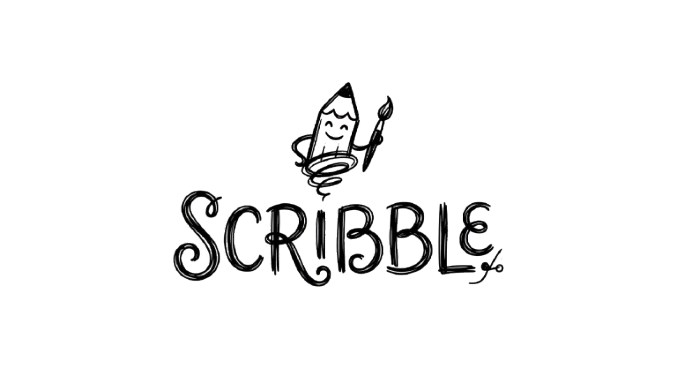

#🎨Scribble

<palign="center">


</p>

<palign="center">
<strong>Amoderncreativetalentdiscoverylandingpage.</strong>

</p>

<palign="center">
<ahref="https://scribblle.netlify.app/">
🌐<strong>LiveDemo</strong>
</a>

</p>

---

##✨About

**Scribble**isamodernandresponsivecreativetalentdiscoverylandingpageinspiredbyplatformslikeDribbble.

Thewebsiteprovidesavisuallyengagingexperiencefordiscoveringcreativeprofessionals,exploringdesigninspiration,andconnectingwithtalenteddesigners.

---

##🚀Features

-🎨ModernandminimalUI
-🖼️Animatedcreatorshowcase
-♾️Infinitehorizontalgallery
-🎬Autoplaycreatorvideos
-❤️Interactiveinspirationcards
-✨Smoothhoveranimations
-📱Fullyresponsivedesign
-🎯Hiring-focusedCTAsections
-🔤GoogleFontsintegration
-🎭RemixIconintegration

---

##🛠️TechStack

-HTML5
-CSS3
-JavaScript
-GoogleFonts
-RemixIcons

---

##🌐LiveWebsite

###👉[https://scribblle.netlify.app/](https://scribblle.netlify.app/)

---

##📸Preview

<palign="center">


</p>

---

##📂ProjectStructure

```text
Scribble/
│
├──index.html
├──style.css
├──responsive.css
├──scribble.png
├──README.md
│
└──imagescreators/
├──01.jpg
├──02.jpg
├──03.jpg
├──...
├──img1.jpg
├──img2.jpg
├──...
├──vid01.mp4
├──vid02.mp4
├──vid03.mp4
└──vid04.mp4
```
